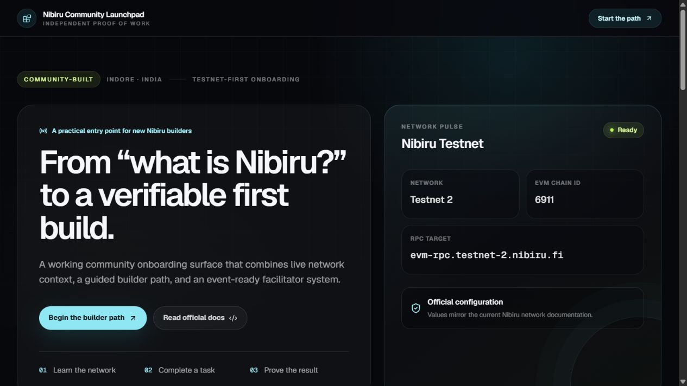

# Nibiru Debug Desk

[](https://nibiru-community-launchpad.arunchandel1780.workers.dev/)
[](https://testnet.nibiscan.io/)
[](#safety-and-attribution)

An independent, read-only troubleshooting utility for Nibiru EVM Testnet 2. It helps a builder identify common network, address, and transaction problems before asking a maintainer or community member for help.

**[Open the live Debug Desk](https://nibiru-community-launchpad.arunchandel1780.workers.dev/)** · **[Official Nibiru network docs](https://nibiru.fi/docs/dev/networks)** · **[Technical case study](docs/TECHNICAL_CASE_STUDY.md)**



## Why this exists

Support conversations often begin without the evidence needed to diagnose a problem: the wrong chain, a stale RPC, a public address that is not a contract, or a transaction hash with no receipt. Debug Desk turns those scattered checks into one simple flow and exports a sanitized Markdown report.

## What is included

| Artifact                 | What can be verified                                                                    |
| ------------------------ | --------------------------------------------------------------------------------------- |
| Live network diagnostics | Testnet 2 chain ID, latest block, block age, gas price, client, sync state, and latency |
| Public address inspector | Balance, nonce, wallet/contract classification, bytecode size, and explorer link        |
| Transaction debugger     | Pending/success/reverted state, confirmations, gas used, cost, and useful next checks   |
| Issue guide              | Clear checks for wrong-network, pending, reverted, missing-contract, and RPC problems   |
| Support report builder   | A sanitized Markdown report combining evidence, observations, and reproduction steps    |
| Verification script      | Repeatable command-line assertions against the live network                             |
| Facilitator playbook     | A 90-minute lab, safety script, metrics, and 30-day follow-up loop                      |

## Repository map

- [`app/api/network/route.ts`](app/api/network/route.ts) — server-side network diagnostics and transaction lookup.
- [`app/api/address/route.ts`](app/api/address/route.ts) — public address inspection.
- [`scripts/verify-network.mjs`](scripts/verify-network.mjs) — independent network verification.
- [`docs/TECHNICAL_CASE_STUDY.md`](docs/TECHNICAL_CASE_STUDY.md) — architecture and decisions.
- [`docs/FACILITATOR_PLAYBOOK.md`](docs/FACILITATOR_PLAYBOOK.md) — event operating system.
- [`components/debug-desk.tsx`](components/debug-desk.tsx) — browser-based diagnostic and report workflow.
- [`docs/EVIDENCE_SCHEMA.md`](docs/EVIDENCE_SCHEMA.md) — evidence data and limitations.
- [`docs/CONTRIBUTION_MAP.md`](docs/CONTRIBUTION_MAP.md) — responsible upstream-feedback path.
- [`evidence/network-check.latest.json`](evidence/network-check.latest.json) — dated machine-readable verification output.

## Verify it yourself

```bash
pnpm install
pnpm verify:nibiru
pnpm lint
pnpm build
```

## What it does not do

It does not connect a wallet, sign transactions, simulate contract execution, or claim to identify every revert reason. It narrows common failure classes and prepares evidence for the next human in the support chain.

## Safety and attribution

This project is maintained independently by [Arun Chandel](https://github.com/Arun5768). It is not affiliated with or endorsed by Nibiru.

- Never enter a seed phrase or private key.
- Use testnet accounts only.
- Testnet tokens have no monetary value.
- The application stores no wallet or transaction data.
- Verify network details against the [official Nibiru Developer Hub](https://nibiru.fi/docs/dev).
