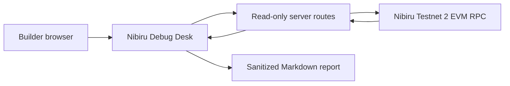

# Technical case study: turning “it failed” into useful evidence

## The problem

Blockchain support often starts with too little context: a screenshot, “my transaction failed,” or a hash from the wrong network. The maintainer then spends the first part of the conversation collecting basic facts instead of solving the issue.

Nibiru Debug Desk is a focused, read-only utility for that gap. It checks the current Nibiru Testnet 2 connection, inspects public chain data, narrows common failure classes, and turns the result into a support report someone else can reproduce.

## What is implemented

- Live JSON-RPC health checks for chain ID, latest block, block age, client, gas price, sync state, and latency.
- Public address inspection for balance, nonce, wallet/contract classification, and bytecode size.
- Transaction diagnosis using both `eth_getTransactionByHash` and `eth_getTransactionReceipt`.
- Clear states for not found, pending, successful, and reverted transactions.
- Receipt details including confirmations, gas used, effective gas price, cost, logs, and contract creation address.
- Symptom-based guidance for wrong networks, pending transactions, reverts, missing contracts, and RPC failures.
- A Markdown report builder combining diagnostics with the user’s observation and reproduction steps.

## Architecture



The browser never asks for a wallet connection, signature, seed phrase, or private key. The server routes accept only a public EVM address or transaction hash and query the official Testnet 2 endpoint.

## Product decisions

1. **A narrow support job:** diagnose before expanding into tutorials or event promotion.
2. **Raw JSON-RPC:** each query remains visible, small, and auditable.
3. **Testnet-only:** no mainnet balance or transaction activity is requested.
4. **Evidence before advice:** the guide is paired with live network and receipt data.
5. **Honest limits:** a receipt can classify a revert, but exact contract-specific causes may still require traces, source, calldata, or tests.
6. **No database:** reports are assembled in the browser and copied or downloaded by the user.

## Verification

```bash
pnpm verify:nibiru
pnpm lint
pnpm build
```

The verification script asserts the official Testnet 2 chain ID (`6911`) and a positive block number. A dated example is committed in [`evidence/network-check.latest.json`](../evidence/network-check.latest.json).

## Useful next iterations

- Add optional transaction simulation when a reliable, documented trace path is available.
- Let maintainers define project-specific checklists without changing the core app.
- Add a privacy review that warns when a report contains likely secrets before copy/download.
- Convert recurring failure patterns into documentation issues or pull requests upstream.

## Official references

- [Nibiru Developer Hub](https://nibiru.fi/docs/dev)
- [Nibiru EVM guides](https://nibiru.fi/docs/dev/evm)
- [Nibiru networks and RPCs](https://nibiru.fi/docs/dev/networks)
- [Nibiru Testnet 2 explorer](https://testnet.nibiscan.io)
- [NibiruChain on GitHub](https://github.com/NibiruChain)
