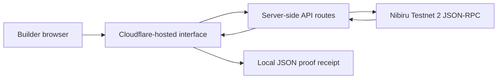

# Technical case study: turning onboarding into evidence

## The problem

Most blockchain onboarding ends when a participant sees a slide deck or adds a network to a wallet. Neither proves that the network worked for them, that they completed an on-chain action, or that an organizer can reproduce the session.

The Nibiru Community Launchpad changes the finish line. A participant can inspect the live Nibiru Testnet 2 state, verify a public address, verify a transaction, and export a transparent evidence receipt. An organizer gets a reusable lab and a measurable outcome model.

## What is implemented

- A server-side JSON-RPC health check for chain ID, latest block, client version, gas price, synchronization state, block age, and latency.
- A public address inspector for balance, nonce, and account type.
- A transaction verifier using `eth_getTransactionByHash`.
- A five-step, locally saved builder checklist.
- A downloadable JSON proof receipt linking the network snapshot, public address, transaction, and completed tasks.
- A 90-minute facilitator playbook designed for a 25–60 person cohort.

## Architecture



The RPC is contacted by server routes, which keeps the browser workflow consistent and prevents the interface from requesting or handling private keys. Only public blockchain identifiers are accepted.

## Technical decisions

1. **Raw JSON-RPC over an SDK:** the first version keeps every network call visible and auditable.
2. **Testnet only:** the lab is safe for workshops and carries no monetary promise.
3. **Local receipt generation:** the user controls the exported file; the application stores no personal or wallet information.
4. **Explicit limitations:** the receipt proves that public state was observable at a time. It is not a credential, identity claim, or endorsement by Nibiru.

## Verification

```bash
pnpm verify:nibiru
pnpm lint
pnpm build
```

The network check asserts the official Testnet 2 chain ID (`6911`) and a positive latest block number. A dated sample output is committed in [`evidence/network-check.latest.json`](../evidence/network-check.latest.json).

## What comes next

- Run the Indore pilot and publish anonymized completion metrics.
- Convert recurring participant friction into documentation issues or pull requests.
- Add an optional smart-contract exercise around Nibiru-specific precompiles after the beginner path is validated.
- Repeat the improved lab in Bhopal and publish the organizer retrospective.

## Official references

- [Nibiru Developer Hub](https://nibiru.fi/docs/dev)
- [Nibiru EVM guides](https://nibiru.fi/docs/dev/evm)
- [Nibiru networks and RPCs](https://nibiru.fi/docs/dev/networks)
- [Nibiru Testnet 2 explorer](https://testnet.nibiscan.io)
- [NibiruChain on GitHub](https://github.com/NibiruChain)
